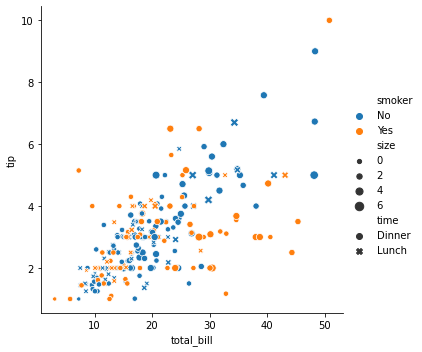
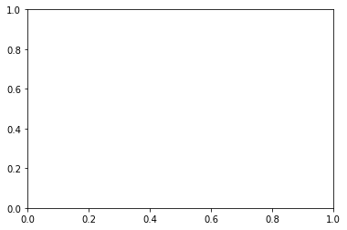
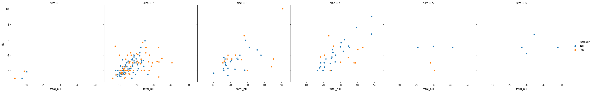
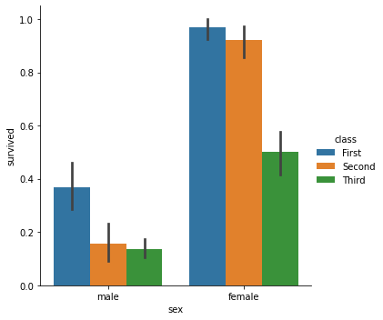

## Seaborn - Explorations

### Scatter Plot 


```python
import seaborn as sns
import pandas as pd
import numpy as np

import matplotlib.pyplot as plt
%matplotlib inline
```


```python
tips = sns.load_dataset('tips')
```


```python
tips.head()
```


<div>
<style scoped>
    .dataframe tbody tr th:only-of-type {
        vertical-align: middle;
    }

    .dataframe tbody tr th {
        vertical-align: top;
    }

    .dataframe thead th {
        text-align: right;
    }
</style>
<table border="1" class="dataframe">
  <thead>
    <tr style="text-align: right;">
      <th></th>
      <th>total_bill</th>
      <th>tip</th>
      <th>sex</th>
      <th>smoker</th>
      <th>day</th>
      <th>time</th>
      <th>size</th>
    </tr>
  </thead>
  <tbody>
    <tr>
      <th>0</th>
      <td>16.99</td>
      <td>1.01</td>
      <td>Female</td>
      <td>No</td>
      <td>Sun</td>
      <td>Dinner</td>
      <td>2</td>
    </tr>
    <tr>
      <th>1</th>
      <td>10.34</td>
      <td>1.66</td>
      <td>Male</td>
      <td>No</td>
      <td>Sun</td>
      <td>Dinner</td>
      <td>3</td>
    </tr>
    <tr>
      <th>2</th>
      <td>21.01</td>
      <td>3.50</td>
      <td>Male</td>
      <td>No</td>
      <td>Sun</td>
      <td>Dinner</td>
      <td>3</td>
    </tr>
    <tr>
      <th>3</th>
      <td>23.68</td>
      <td>3.31</td>
      <td>Male</td>
      <td>No</td>
      <td>Sun</td>
      <td>Dinner</td>
      <td>2</td>
    </tr>
    <tr>
      <th>4</th>
      <td>24.59</td>
      <td>3.61</td>
      <td>Female</td>
      <td>No</td>
      <td>Sun</td>
      <td>Dinner</td>
      <td>4</td>
    </tr>
  </tbody>
</table>
</div>


```python
sns.relplot(x = 'total_bill', y = 'tip', data = tips)
```


    <seaborn.axisgrid.FacetGrid at 0x107dfce50>


### Hue,  Style and Size


```python
sns.relplot(x = 'total_bill', y = 'tip', data = tips, hue = 'smoker')
```


    <seaborn.axisgrid.FacetGrid at 0x11d0a7c70>


```python
sns.relplot(x = 'total_bill', y = 'tip', data = tips, hue = 'smoker', style = 'time')
```


    <seaborn.axisgrid.FacetGrid at 0x11d17f820>


```python
tips.columns
```


    Index(['total_bill', 'tip', 'sex', 'smoker', 'day', 'time', 'size'], dtype='object')


```python
sns.relplot(x = 'total_bill', y = 'tip', data = tips, hue = 'smoker', style = 'time', size= 'size')
```


    <seaborn.axisgrid.FacetGrid at 0x109cc97c0>





```python
sns.relplot(x = 'total_bill', y = 'tip', data = tips, style = 'size')
```


    <seaborn.axisgrid.FacetGrid at 0x11d5852e0>


```python
tips['size'].value_counts()
```


    2    156
    3     38
    4     37
    5      5
    6      4
    1      4
    Name: size, dtype: int64


```python
sns.relplot(x = 'total_bill', y = 'tip', data = tips, style = 'smoker')
```


    <seaborn.axisgrid.FacetGrid at 0x11d6e5e80>


```python
tips['smoker'].value_counts()
```


    No     151
    Yes     93
    Name: smoker, dtype: int64


```python
sns.relplot(x = 'total_bill', y = 'tip', data = tips, size = 'size', sizes = (15, 200))
```


    <seaborn.axisgrid.FacetGrid at 0x11d734670>


```python
tips['time'].value_counts()
```


    Dinner    176
    Lunch      68
    Name: time, dtype: int64


### Line Plot 


```python
from seaborn import relplot
```


```python
from numpy.random import randn
```


```python
df = pd.DataFrame(dict(time = np.arange(500), value = randn(500).cumsum()))
```


```python
relplot(x = 'time', y = 'value', kind = 'line', data = df)
```


    <seaborn.axisgrid.FacetGrid at 0x11b2116a0>


```python
fmri = sns.load_dataset('fmri')
fmri.head()
```


<div>
<style scoped>
    .dataframe tbody tr th:only-of-type {
        vertical-align: middle;
    }

    .dataframe tbody tr th {
        vertical-align: top;
    }

    .dataframe thead th {
        text-align: right;
    }
</style>
<table border="1" class="dataframe">
  <thead>
    <tr style="text-align: right;">
      <th></th>
      <th>subject</th>
      <th>timepoint</th>
      <th>event</th>
      <th>region</th>
      <th>signal</th>
    </tr>
  </thead>
  <tbody>
    <tr>
      <th>0</th>
      <td>s13</td>
      <td>18</td>
      <td>stim</td>
      <td>parietal</td>
      <td>-0.017552</td>
    </tr>
    <tr>
      <th>1</th>
      <td>s5</td>
      <td>14</td>
      <td>stim</td>
      <td>parietal</td>
      <td>-0.080883</td>
    </tr>
    <tr>
      <th>2</th>
      <td>s12</td>
      <td>18</td>
      <td>stim</td>
      <td>parietal</td>
      <td>-0.081033</td>
    </tr>
    <tr>
      <th>3</th>
      <td>s11</td>
      <td>18</td>
      <td>stim</td>
      <td>parietal</td>
      <td>-0.046134</td>
    </tr>
    <tr>
      <th>4</th>
      <td>s10</td>
      <td>18</td>
      <td>stim</td>
      <td>parietal</td>
      <td>-0.037970</td>
    </tr>
  </tbody>
</table>
</div>


```python
fig, ax = plt.subplots()
sns.relplot(x = 'timepoint', y = 'signal', kind = 'line', data = fmri, label = 'Sine')
```


    <seaborn.axisgrid.FacetGrid at 0x11b46bc40>





```python
relplot(x = 'timepoint', y = 'signal', kind = 'line', data = fmri, label = 'Signal', height = 4, aspect = 2)
plt.legend(loc='right')
```


    <matplotlib.legend.Legend at 0x11b3c5700>


```python
fmri[fmri['timepoint']==5].min()
```


    subject             s0
    timepoint            5
    event              cue
    region         frontal
    signal      -0.0179456
    dtype: object


```python
relplot(x = 'timepoint', y = 'signal', kind = 'line', estimator = None, data = fmri, label = 'Signal', height = 4, aspect = 2)
plt.legend(loc='right')
```


    <matplotlib.legend.Legend at 0x11b4e75e0>


```python
relplot(x = 'timepoint', y = 'signal', kind = 'line', hue = 'event', data = fmri, label = 'Signal', height = 4, aspect = 2)
plt.legend(loc='right')
```


    <matplotlib.legend.Legend at 0x11b5bf730>


```python
relplot(x = 'timepoint', y = 'signal', kind = 'line', hue = 'event', style = 'region', data = fmri, label = 'Signal', height = 4, aspect = 2)
plt.legend(loc='right')
```


    <matplotlib.legend.Legend at 0x11b4eb760>


```python
relplot(x = 'timepoint', y = 'signal', kind = 'line', style = 'event', marker = True, dashes = False, data = fmri, label = 'Signal', height = 4, aspect = 2)
plt.legend(loc='right')
```


    <matplotlib.legend.Legend at 0x11bb79f40>


```python
dots = sns.load_dataset('dots').query("align == 'dots'")
```


```python
dots.head()
```


<div>
<style scoped>
    .dataframe tbody tr th:only-of-type {
        vertical-align: middle;
    }

    .dataframe tbody tr th {
        vertical-align: top;
    }

    .dataframe thead th {
        text-align: right;
    }
</style>
<table border="1" class="dataframe">
  <thead>
    <tr style="text-align: right;">
      <th></th>
      <th>align</th>
      <th>choice</th>
      <th>time</th>
      <th>coherence</th>
      <th>firing_rate</th>
    </tr>
  </thead>
  <tbody>
    <tr>
      <th>0</th>
      <td>dots</td>
      <td>T1</td>
      <td>-80</td>
      <td>0.0</td>
      <td>33.189967</td>
    </tr>
    <tr>
      <th>1</th>
      <td>dots</td>
      <td>T1</td>
      <td>-80</td>
      <td>3.2</td>
      <td>31.691726</td>
    </tr>
    <tr>
      <th>2</th>
      <td>dots</td>
      <td>T1</td>
      <td>-80</td>
      <td>6.4</td>
      <td>34.279840</td>
    </tr>
    <tr>
      <th>3</th>
      <td>dots</td>
      <td>T1</td>
      <td>-80</td>
      <td>12.8</td>
      <td>32.631874</td>
    </tr>
    <tr>
      <th>4</th>
      <td>dots</td>
      <td>T1</td>
      <td>-80</td>
      <td>25.6</td>
      <td>35.060487</td>
    </tr>
  </tbody>
</table>
</div>


```python
relplot(x = 'time', y = 'firing_rate', data = dots, kind = 'line')
```


    <seaborn.axisgrid.FacetGrid at 0x11baa4d90>


```python
relplot(x = 'time', y = 'firing_rate', data = dots, kind = 'line', hue = 'coherence', style = 'choice')
```


    <seaborn.axisgrid.FacetGrid at 0x11c555490>


```python
pallette = sns.cubehelix_palette(light = 0.9, n_colors = 6)
relplot(x = 'time', y = 'firing_rate', data = dots, kind = 'line', hue = 'coherence', style = 'choice', palette = pallette)
```


    <seaborn.axisgrid.FacetGrid at 0x11c5bddc0>


```python
relplot(x = 'time', y = 'firing_rate', data = dots, kind = 'line', hue = 'coherence', style = 'choice', size = 'choice')
```


    <seaborn.axisgrid.FacetGrid at 0x11c5bd850>


### Subplots 


```python
tips.head()
```


<div>
<style scoped>
    .dataframe tbody tr th:only-of-type {
        vertical-align: middle;
    }

    .dataframe tbody tr th {
        vertical-align: top;
    }

    .dataframe thead th {
        text-align: right;
    }
</style>
<table border="1" class="dataframe">
  <thead>
    <tr style="text-align: right;">
      <th></th>
      <th>total_bill</th>
      <th>tip</th>
      <th>sex</th>
      <th>smoker</th>
      <th>day</th>
      <th>time</th>
      <th>size</th>
    </tr>
  </thead>
  <tbody>
    <tr>
      <th>0</th>
      <td>16.99</td>
      <td>1.01</td>
      <td>Female</td>
      <td>No</td>
      <td>Sun</td>
      <td>Dinner</td>
      <td>2</td>
    </tr>
    <tr>
      <th>1</th>
      <td>10.34</td>
      <td>1.66</td>
      <td>Male</td>
      <td>No</td>
      <td>Sun</td>
      <td>Dinner</td>
      <td>3</td>
    </tr>
    <tr>
      <th>2</th>
      <td>21.01</td>
      <td>3.50</td>
      <td>Male</td>
      <td>No</td>
      <td>Sun</td>
      <td>Dinner</td>
      <td>3</td>
    </tr>
    <tr>
      <th>3</th>
      <td>23.68</td>
      <td>3.31</td>
      <td>Male</td>
      <td>No</td>
      <td>Sun</td>
      <td>Dinner</td>
      <td>2</td>
    </tr>
    <tr>
      <th>4</th>
      <td>24.59</td>
      <td>3.61</td>
      <td>Female</td>
      <td>No</td>
      <td>Sun</td>
      <td>Dinner</td>
      <td>4</td>
    </tr>
  </tbody>
</table>
</div>


```python
relplot(x = 'total_bill', y = 'tip', hue = 'smoker', col = 'smoker', data = tips)
```


    <seaborn.axisgrid.FacetGrid at 0x11bcc0400>


```python
relplot(x = 'total_bill', y = 'tip', hue = 'smoker', col = 'size', data = tips)
```


    <seaborn.axisgrid.FacetGrid at 0x11caba8e0>





```python
relplot(x = 'total_bill', y = 'tip', hue = 'smoker', col = 'time', data = tips, row = 'size')
```


    <seaborn.axisgrid.FacetGrid at 0x11d1a98e0>


```python
relplot(x = 'total_bill', y = 'tip', hue = 'smoker', col = 'size', data = tips, col_wrap=3)
```


    <seaborn.axisgrid.FacetGrid at 0x11cd7f400>


### Using sns.lineplot() and sns.scatterplot()


```python
fmri.head()
```


<div>
<style scoped>
    .dataframe tbody tr th:only-of-type {
        vertical-align: middle;
    }

    .dataframe tbody tr th {
        vertical-align: top;
    }

    .dataframe thead th {
        text-align: right;
    }
</style>
<table border="1" class="dataframe">
  <thead>
    <tr style="text-align: right;">
      <th></th>
      <th>subject</th>
      <th>timepoint</th>
      <th>event</th>
      <th>region</th>
      <th>signal</th>
    </tr>
  </thead>
  <tbody>
    <tr>
      <th>0</th>
      <td>s13</td>
      <td>18</td>
      <td>stim</td>
      <td>parietal</td>
      <td>-0.017552</td>
    </tr>
    <tr>
      <th>1</th>
      <td>s5</td>
      <td>14</td>
      <td>stim</td>
      <td>parietal</td>
      <td>-0.080883</td>
    </tr>
    <tr>
      <th>2</th>
      <td>s12</td>
      <td>18</td>
      <td>stim</td>
      <td>parietal</td>
      <td>-0.081033</td>
    </tr>
    <tr>
      <th>3</th>
      <td>s11</td>
      <td>18</td>
      <td>stim</td>
      <td>parietal</td>
      <td>-0.046134</td>
    </tr>
    <tr>
      <th>4</th>
      <td>s10</td>
      <td>18</td>
      <td>stim</td>
      <td>parietal</td>
      <td>-0.037970</td>
    </tr>
  </tbody>
</table>
</div>


```python
sns.lineplot(x = 'timepoint', y = 'signal', style = 'event', hue = 'region', data = fmri, markers = True, ci = 68, err_style = 'bars')
```


    <matplotlib.axes._subplots.AxesSubplot at 0x11efd5f70>


```python
sns.lineplot(x = 'timepoint', y = 'signal',  hue = 'event', data = fmri.query("region == 'frontal'"), estimator = None, lw = 1)
```


    <matplotlib.axes._subplots.AxesSubplot at 0x11efa2430>


```python
sns.scatterplot(x = 'total_bill', y = 'tip', data = tips, hue = 'smoker', size = 'size', style = 'time')
```


    <matplotlib.axes._subplots.AxesSubplot at 0x11f79dd00>


## Categorical Data Ploting 

### Cat Plot 


```python
tips.head()
```


<div>
<style scoped>
    .dataframe tbody tr th:only-of-type {
        vertical-align: middle;
    }

    .dataframe tbody tr th {
        vertical-align: top;
    }

    .dataframe thead th {
        text-align: right;
    }
</style>
<table border="1" class="dataframe">
  <thead>
    <tr style="text-align: right;">
      <th></th>
      <th>total_bill</th>
      <th>tip</th>
      <th>sex</th>
      <th>smoker</th>
      <th>day</th>
      <th>time</th>
      <th>size</th>
    </tr>
  </thead>
  <tbody>
    <tr>
      <th>0</th>
      <td>16.99</td>
      <td>1.01</td>
      <td>Female</td>
      <td>No</td>
      <td>Sun</td>
      <td>Dinner</td>
      <td>2</td>
    </tr>
    <tr>
      <th>1</th>
      <td>10.34</td>
      <td>1.66</td>
      <td>Male</td>
      <td>No</td>
      <td>Sun</td>
      <td>Dinner</td>
      <td>3</td>
    </tr>
    <tr>
      <th>2</th>
      <td>21.01</td>
      <td>3.50</td>
      <td>Male</td>
      <td>No</td>
      <td>Sun</td>
      <td>Dinner</td>
      <td>3</td>
    </tr>
    <tr>
      <th>3</th>
      <td>23.68</td>
      <td>3.31</td>
      <td>Male</td>
      <td>No</td>
      <td>Sun</td>
      <td>Dinner</td>
      <td>2</td>
    </tr>
    <tr>
      <th>4</th>
      <td>24.59</td>
      <td>3.61</td>
      <td>Female</td>
      <td>No</td>
      <td>Sun</td>
      <td>Dinner</td>
      <td>4</td>
    </tr>
  </tbody>
</table>
</div>


```python
sns.catplot(x = 'day', y = 'total_bill', data = tips)
```


    <seaborn.axisgrid.FacetGrid at 0x11d10ee80>


```python
sns.catplot(x = 'total_bill', y = 'day', data = tips)
```


    <seaborn.axisgrid.FacetGrid at 0x11f874b20>


```python
sns.catplot(x = 'day', y = 'total_bill', data = tips, jitter = False)
```


    <seaborn.axisgrid.FacetGrid at 0x11fa17610>


```python
sns.catplot(x = 'day', y = 'total_bill', data = tips, kind = 'swarm', hue = 'size')
```


    <seaborn.axisgrid.FacetGrid at 0x11f8d07f0>


```python
sns.catplot(x = 'smoker', y = 'tip', data = tips, order = ['No', 'Yes'])
```


    <seaborn.axisgrid.FacetGrid at 0x11fd3a760>


### Box Plot 


```python
sns.catplot(x = 'day', y = 'total_bill', kind = 'box', data = tips, hue = 'sex')
```


    <seaborn.axisgrid.FacetGrid at 0x11fea6d00>


```python
sns.catplot(x = 'day', y = 'total_bill', kind = 'box', data = tips, hue = 'sex', dodge = False)
```


    <seaborn.axisgrid.FacetGrid at 0x11feac340>


### Boxen Plot 


```python
diamonds = sns.load_dataset('diamonds')
```


```python
diamonds.head()
```


<div>
<style scoped>
    .dataframe tbody tr th:only-of-type {
        vertical-align: middle;
    }

    .dataframe tbody tr th {
        vertical-align: top;
    }

    .dataframe thead th {
        text-align: right;
    }
</style>
<table border="1" class="dataframe">
  <thead>
    <tr style="text-align: right;">
      <th></th>
      <th>carat</th>
      <th>cut</th>
      <th>color</th>
      <th>clarity</th>
      <th>depth</th>
      <th>table</th>
      <th>price</th>
      <th>x</th>
      <th>y</th>
      <th>z</th>
    </tr>
  </thead>
  <tbody>
    <tr>
      <th>0</th>
      <td>0.23</td>
      <td>Ideal</td>
      <td>E</td>
      <td>SI2</td>
      <td>61.5</td>
      <td>55.0</td>
      <td>326</td>
      <td>3.95</td>
      <td>3.98</td>
      <td>2.43</td>
    </tr>
    <tr>
      <th>1</th>
      <td>0.21</td>
      <td>Premium</td>
      <td>E</td>
      <td>SI1</td>
      <td>59.8</td>
      <td>61.0</td>
      <td>326</td>
      <td>3.89</td>
      <td>3.84</td>
      <td>2.31</td>
    </tr>
    <tr>
      <th>2</th>
      <td>0.23</td>
      <td>Good</td>
      <td>E</td>
      <td>VS1</td>
      <td>56.9</td>
      <td>65.0</td>
      <td>327</td>
      <td>4.05</td>
      <td>4.07</td>
      <td>2.31</td>
    </tr>
    <tr>
      <th>3</th>
      <td>0.29</td>
      <td>Premium</td>
      <td>I</td>
      <td>VS2</td>
      <td>62.4</td>
      <td>58.0</td>
      <td>334</td>
      <td>4.20</td>
      <td>4.23</td>
      <td>2.63</td>
    </tr>
    <tr>
      <th>4</th>
      <td>0.31</td>
      <td>Good</td>
      <td>J</td>
      <td>SI2</td>
      <td>63.3</td>
      <td>58.0</td>
      <td>335</td>
      <td>4.34</td>
      <td>4.35</td>
      <td>2.75</td>
    </tr>
  </tbody>
</table>
</div>


```python
sns.catplot(x = 'color', y = 'price', kind = 'boxen', data = diamonds)
```


    <seaborn.axisgrid.FacetGrid at 0x11caacc70>


```python
sns.catplot(x = 'color', y = 'price', kind = 'boxen', data = diamonds, hue = 'cut')
```


    <seaborn.axisgrid.FacetGrid at 0x121896d00>


### Violin Plot 


```python
sns.catplot(x = 'total_bill', y = 'day', data = tips, kind = 'violin', hue = 'sex', split = True)
```


    <seaborn.axisgrid.FacetGrid at 0x11feda340>


```python
g = sns.catplot(x = 'day', y = 'total_bill', data = tips, kind = 'swarm')
sns.catplot(x = 'day', y = 'total_bill', data = tips, kind = 'violin', ax = g.ax, color = 'k')
```

    /opt/anaconda3/lib/python3.8/site-packages/seaborn/categorical.py:3717: UserWarning: catplot is a figure-level function and does not accept target axes. You may wish to try violinplot
      warnings.warn(msg, UserWarning)


    <seaborn.axisgrid.FacetGrid at 0x121d751c0>


### Bar Plot 


```python
titanic = sns.load_dataset('titanic')
```


```python
titanic.head()
```


<div>
<style scoped>
    .dataframe tbody tr th:only-of-type {
        vertical-align: middle;
    }

    .dataframe tbody tr th {
        vertical-align: top;
    }

    .dataframe thead th {
        text-align: right;
    }
</style>
<table border="1" class="dataframe">
  <thead>
    <tr style="text-align: right;">
      <th></th>
      <th>survived</th>
      <th>pclass</th>
      <th>sex</th>
      <th>age</th>
      <th>sibsp</th>
      <th>parch</th>
      <th>fare</th>
      <th>embarked</th>
      <th>class</th>
      <th>who</th>
      <th>adult_male</th>
      <th>deck</th>
      <th>embark_town</th>
      <th>alive</th>
      <th>alone</th>
    </tr>
  </thead>
  <tbody>
    <tr>
      <th>0</th>
      <td>0</td>
      <td>3</td>
      <td>male</td>
      <td>22.0</td>
      <td>1</td>
      <td>0</td>
      <td>7.2500</td>
      <td>S</td>
      <td>Third</td>
      <td>man</td>
      <td>True</td>
      <td>NaN</td>
      <td>Southampton</td>
      <td>no</td>
      <td>False</td>
    </tr>
    <tr>
      <th>1</th>
      <td>1</td>
      <td>1</td>
      <td>female</td>
      <td>38.0</td>
      <td>1</td>
      <td>0</td>
      <td>71.2833</td>
      <td>C</td>
      <td>First</td>
      <td>woman</td>
      <td>False</td>
      <td>C</td>
      <td>Cherbourg</td>
      <td>yes</td>
      <td>False</td>
    </tr>
    <tr>
      <th>2</th>
      <td>1</td>
      <td>3</td>
      <td>female</td>
      <td>26.0</td>
      <td>0</td>
      <td>0</td>
      <td>7.9250</td>
      <td>S</td>
      <td>Third</td>
      <td>woman</td>
      <td>False</td>
      <td>NaN</td>
      <td>Southampton</td>
      <td>yes</td>
      <td>True</td>
    </tr>
    <tr>
      <th>3</th>
      <td>1</td>
      <td>1</td>
      <td>female</td>
      <td>35.0</td>
      <td>1</td>
      <td>0</td>
      <td>53.1000</td>
      <td>S</td>
      <td>First</td>
      <td>woman</td>
      <td>False</td>
      <td>C</td>
      <td>Southampton</td>
      <td>yes</td>
      <td>False</td>
    </tr>
    <tr>
      <th>4</th>
      <td>0</td>
      <td>3</td>
      <td>male</td>
      <td>35.0</td>
      <td>0</td>
      <td>0</td>
      <td>8.0500</td>
      <td>S</td>
      <td>Third</td>
      <td>man</td>
      <td>True</td>
      <td>NaN</td>
      <td>Southampton</td>
      <td>no</td>
      <td>True</td>
    </tr>
  </tbody>
</table>
</div>


```python
sns.catplot(x = 'sex', y = 'survived', kind = 'bar', data = titanic, hue = 'class')
```


    <seaborn.axisgrid.FacetGrid at 0x121c796a0>





```python
sns.catplot(x = 'sex', y = 'survived', kind = 'bar', data = titanic, hue = 'class', palette='ch:0.65')
```


    <seaborn.axisgrid.FacetGrid at 0x11996a880>


### Point Plot 


```python
sns.catplot(x = 'sex', y = 'survived', hue = 'class', kind = 'point', data = titanic)
```


    <seaborn.axisgrid.FacetGrid at 0x120e66250>


### Joint Plot 


```python
tips.head()
```


<div>
<style scoped>
    .dataframe tbody tr th:only-of-type {
        vertical-align: middle;
    }

    .dataframe tbody tr th {
        vertical-align: top;
    }

    .dataframe thead th {
        text-align: right;
    }
</style>
<table border="1" class="dataframe">
  <thead>
    <tr style="text-align: right;">
      <th></th>
      <th>total_bill</th>
      <th>tip</th>
      <th>sex</th>
      <th>smoker</th>
      <th>day</th>
      <th>time</th>
      <th>size</th>
    </tr>
  </thead>
  <tbody>
    <tr>
      <th>0</th>
      <td>16.99</td>
      <td>1.01</td>
      <td>Female</td>
      <td>No</td>
      <td>Sun</td>
      <td>Dinner</td>
      <td>2</td>
    </tr>
    <tr>
      <th>1</th>
      <td>10.34</td>
      <td>1.66</td>
      <td>Male</td>
      <td>No</td>
      <td>Sun</td>
      <td>Dinner</td>
      <td>3</td>
    </tr>
    <tr>
      <th>2</th>
      <td>21.01</td>
      <td>3.50</td>
      <td>Male</td>
      <td>No</td>
      <td>Sun</td>
      <td>Dinner</td>
      <td>3</td>
    </tr>
    <tr>
      <th>3</th>
      <td>23.68</td>
      <td>3.31</td>
      <td>Male</td>
      <td>No</td>
      <td>Sun</td>
      <td>Dinner</td>
      <td>2</td>
    </tr>
    <tr>
      <th>4</th>
      <td>24.59</td>
      <td>3.61</td>
      <td>Female</td>
      <td>No</td>
      <td>Sun</td>
      <td>Dinner</td>
      <td>4</td>
    </tr>
  </tbody>
</table>
</div>


```python
x = tips['total_bill']
y = tips['tip']
```


```python
sns.jointplot(x, y)
```


    <seaborn.axisgrid.JointGrid at 0x121bfee80>


```python
sns.jointplot(x, y, kind = 'hex')
```


    <seaborn.axisgrid.JointGrid at 0x121762280>


```python
sns.jointplot(x, y, kind = 'kde')
```


    <seaborn.axisgrid.JointGrid at 0x121bbc370>


### Pair Plot 


```python
sns.pairplot(tips)
```


    <seaborn.axisgrid.PairGrid at 0x11ceebfa0>


```python
g = sns.PairGrid(tips)
g.map_diag(sns.kdeplot)
g.map_offdiag(sns.kdeplot, n_levels = 10)
```


    <seaborn.axisgrid.PairGrid at 0x122516400>


```python
g = sns.PairGrid(tips)
g.map_diag(sns.kdeplot)
g.map_offdiag(sns.scatterplot)
```


    <seaborn.axisgrid.PairGrid at 0x122b081f0>


### Regression Plot 


```python
tips.head()
```


<div>
<style scoped>
    .dataframe tbody tr th:only-of-type {
        vertical-align: middle;
    }

    .dataframe tbody tr th {
        vertical-align: top;
    }

    .dataframe thead th {
        text-align: right;
    }
</style>
<table border="1" class="dataframe">
  <thead>
    <tr style="text-align: right;">
      <th></th>
      <th>total_bill</th>
      <th>tip</th>
      <th>sex</th>
      <th>smoker</th>
      <th>day</th>
      <th>time</th>
      <th>size</th>
    </tr>
  </thead>
  <tbody>
    <tr>
      <th>0</th>
      <td>16.99</td>
      <td>1.01</td>
      <td>Female</td>
      <td>No</td>
      <td>Sun</td>
      <td>Dinner</td>
      <td>2</td>
    </tr>
    <tr>
      <th>1</th>
      <td>10.34</td>
      <td>1.66</td>
      <td>Male</td>
      <td>No</td>
      <td>Sun</td>
      <td>Dinner</td>
      <td>3</td>
    </tr>
    <tr>
      <th>2</th>
      <td>21.01</td>
      <td>3.50</td>
      <td>Male</td>
      <td>No</td>
      <td>Sun</td>
      <td>Dinner</td>
      <td>3</td>
    </tr>
    <tr>
      <th>3</th>
      <td>23.68</td>
      <td>3.31</td>
      <td>Male</td>
      <td>No</td>
      <td>Sun</td>
      <td>Dinner</td>
      <td>2</td>
    </tr>
    <tr>
      <th>4</th>
      <td>24.59</td>
      <td>3.61</td>
      <td>Female</td>
      <td>No</td>
      <td>Sun</td>
      <td>Dinner</td>
      <td>4</td>
    </tr>
  </tbody>
</table>
</div>


```python
sns.regplot(x = 'total_bill', y = 'tip', data = tips)
```


    <matplotlib.axes._subplots.AxesSubplot at 0x122163f10>


```python
sns.lmplot(x = 'size', y = 'tip', data = tips)
```


    <seaborn.axisgrid.FacetGrid at 0x1224c8910>


### Controlling Ploted Figure Aesthetics
- figure styling
- axes styling
- color palettes
- etc..


```python
def sinplot(flip = 1):
    x = np.linspace(0, 14, 100)
    for i in range(1, 7):
        plt.plot(x, np.sin(x + i*0.5)*(7-i)*flip)
```


```python
sinplot()
```


```python
sinplot(-1)
```


```python
sns.set_style('ticks', {'axes.grid': True, 'xticks.direction': 'in'})
sinplot()

```


```python
sns.set_style('ticks', {'axes.grid': True, 'xticks.direction': 'in'})
sinplot()
sns.despine()
```


```python
sns.axes_style()
```


    {'axes.facecolor': 'white',
     'axes.edgecolor': '.15',
     'axes.grid': True,
     'axes.axisbelow': True,
     'axes.labelcolor': '.15',
     'figure.facecolor': 'white',
     'grid.color': '.8',
     'grid.linestyle': '-',
     'text.color': '.15',
     'xtick.color': '.15',
     'ytick.color': '.15',
     'xtick.direction': 'out',
     'ytick.direction': 'out',
     'lines.solid_capstyle': 'round',
     'patch.edgecolor': 'w',
     'patch.force_edgecolor': True,
     'image.cmap': 'rocket',
     'font.family': ['sans-serif'],
     'font.sans-serif': ['Arial',
      'DejaVu Sans',
      'Liberation Sans',
      'Bitstream Vera Sans',
      'sans-serif'],
     'xtick.bottom': True,
     'xtick.top': False,
     'ytick.left': True,
     'ytick.right': False,
     'axes.spines.left': True,
     'axes.spines.bottom': True,
     'axes.spines.right': True,
     'axes.spines.top': True}


```python
sns.set_style('darkgrid')
```


```python
sinplot()
```


